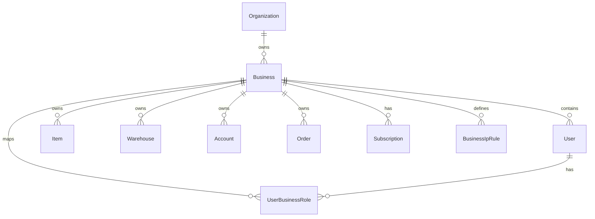

# PROJECT_CONTEXT.md

## 1. Executive Summary
AgriQon is a production-scale business management and logistics ERP operating system. Originally designed as an agriculture-focused B2B2C marketplace connecting buyers and sellers, the platform is undergoing a major strategic pivot into a B2B Multi-Tenant SaaS ERP platform. 
The system is built as a monorepo containing two typescript packages:
*   `frontend/` (Next.js 16 App Router, Tailwind CSS v4 PostCSS, Zustand, React Query, shadcn/ui)
*   `backend/` (Express, Prisma client pointing to `src/generated/client`, PostgreSQL with pgvector, Redis, BullMQ)

All core database structures, tenancy isolation boundaries (`businessId`), permission-based Role-Based Access Control (RBAC), double-entry accounting automation, background reconciliation systems, and subscription models have been implemented and validated on the backend. The frontend dashboard views are operational, though legacy auth contexts and registration pages are in the process of being updated.

---

## 2. Product Vision
The product vision is to establish AgriQon as a unified "Business Management OS" for distributors, trading companies, wholesalers, and multi-warehouse operations. Instead of matching buyers with growers in an open marketplace, the platform provides private, enterprise-grade workspaces. In this workspace, businesses can track physical goods, handle double-entry general ledger bookkeeping, automate invoicing, process payments, and leverage AI to predict supply chain risks.

---

## 3. Business Problem Being Solved
AgriQon addresses major friction points in SME and distributor operations:
1.  **Inventory-Sales Desynchronization**: Physical inventory quantities are disconnected from sales orders and purchases, causing stockouts or excess capital allocation in dead stock.
2.  **Financial Leakage**: Single-entry spreadsheets lack double-entry balancing, leading to unaccounted discrepancies, cash flow drift, and audit failures.
3.  **Cross-Tenant Leakage Risks**: Sharing platforms without strict schema-level or query-level tenancy isolation exposes private client ledgers and product catalogs.
4.  **Operational Blindness**: Lack of actionable intelligence to forecast demand or flag credit risk leads to reactive operations.

---

## 4. Target Customer Profile
The target customers are distributors, importers/exporters, wholesalers, and agricultural supply chain operators who:
*   Manage physical goods across one or more warehouses.
*   Employ between 3 and 50 staff members (e.g., warehouse keepers, cashiers, accountants, sales reps).
*   Process moderate to high transaction volumes requiring automated invoicing and payments.
*   Are based in developing trade markets, primarily using Bangladesh Taka (BDT) and Middle East (AED) transaction semantics.

---

## 5. ICP (Ideal Customer Profile)
*   **Sector**: Mid-sized B2B Distributors and Trading Companies.
*   **Annual Revenue**: $500,000 to $10,000,000 USD.
*   **Scale**: 2+ physical warehouses, 20+ staff members, and 500+ product SKUs.
*   **Tech Stack**: Transitioning away from fragmented spreadsheets, paper-based invoices, and basic legacy accounting programs to a modern, unified, cloud-based platform.

---

## 6. Current Product Positioning
AgriQon is positioned as an **AI-Powered Multi-Tenant ERP SaaS**. It moves beyond standard database entry tools by embedding an immutable double-entry ledger that updates automatically based on business events (like order creation or delivery) and running background audits. The frontend landing page and theme are styled under the marketing name **"Velocity"**, positioning the tool as a fast, intelligence-driven operating system rather than a slow, static system of record.

---

## 7. Long-Term Vision
The long-term vision is to expand the platform into a fully automated enterprise coordinator. It will feature offline-capable Point of Sale (POS) terminals, unified Human Resource Management (HRM) with automated payroll journals, customer relation management pipelines, and autonomous AI agents. These agents will execute purchase orders, optimize stock transfers across warehouses, and schedule collections based on historical payment patterns.

---

## 8. Current System Scope
The system contains the following scoped services and boundaries:

```mermaid
graph TD
    subgraph Client Layer
        WebClient[Next.js Web App]
    end

    subgraph API Gateways
        Express[Express Server]
        CSRF[csurf Cookie Gate]
        RateLimit[express-rate-limit]
        Auth[extractAuth Middleware]
        Tenant[requireTenant Middleware]
        RBAC[attachBusinessRole & authorizeAny]
    end

    subgraph Core Tenant Workspace
        Products[Products & Batches]
        Inventory[Inventory & Warehouses]
        Sales[Orders & Invoices]
        Accounting[Accounts & Journal Entries]
    end

    subgraph Messaging & Workers
        OutboxTable[(OutboxEvent Table)]
        OutboxProc[OutboxProcessor Poller]
        Redis[(Redis Port 6380)]
        BullMQ[BullMQ Queues]
        Workers[Background Workers]
    end

    WebClient --> CSRF
    CSRF --> RateLimit
    RateLimit --> Express
    Express --> Auth
    Auth --> Tenant
    Tenant --> RBAC
    RBAC --> Core Tenant Workspace
    
    Core Tenant Workspace --> OutboxTable
    OutboxTable --> OutboxProc
    OutboxProc --> Redis
    Redis --> BullMQ
    BullMQ --> Workers
    Workers --> Core Tenant Workspace
```

---

## 9. Completed Modules
Based on the repository code and database schema, the following modules are fully written, tested, and active on the backend:

1.  **Auth Subsystem (90% Complete)**: Supports JWT tokens via Bearer headers and HttpOnly cookies, session tracking via refresh token family rotation, Speakeasy-powered MFA, and login attempts lockout policies.
2.  **Tenancy Isolation (95% Complete)**: Enforces business-scoping (`businessId`) at the data layer and routes level via `requireTenant` middleware.
3.  **Roles & Permissions (85% Complete)**: The backend has 86 unique permission keys seeded. The frontend includes `PermissionGate` and Zustand state mapping, but route guards are pending.
4.  **Inventory & Warehousing (95% Complete)**: Implements physical stock levels (available, reserved, total), batch tracking (expiry dates), warehouse transfers, reservations, and optimistic concurrency version controls.
5.  **Double-Entry Accounting (95% Complete)**: Automatic journal generation for sales, payments, purchases, refunds, stock adjustments, and transfers.
6.  **Reconciliation Engine (95% Complete)**: Audits journal balances, inventory drift, AR/AP drift, outbox staleness, and duplicate events.
7.  **SaaS Subscription & Billing (95% Complete)**: Trial and Pro plans, feature gating, resource limits, and payment gateway sandbox integrations (SSLCommerz, Nagad, bKash).
8.  **AI Service (90% Complete)**: Embeddings synchronization, similarity searches, and enriched RAG context for chat responses.

---

## 10. Partially Completed Modules
1.  **Authentication Migration (Frontend Auth Context)**:
    *   **Fact**: The `auth-context.tsx` and registration page still include legacy `Buyer`/`Seller` selections and types.
    *   **Gaps**: Needs replacement with standard SaaS forms, removal of the role selection UI, and updates to the user role types (`OWNER`, `MANAGER`, `STAFF`).
2.  **Backend Auth Registration Refactoring**:
    *   **Fact**: Backend registration endpoints still accept legacy roles and lack auto-tenant provisioning on signup.
    *   **Gaps**: Endpoints must be refactored to auto-create an Organization and Business tenant for the first user, and assign the `OWNER` role.
3.  **UI Component Refactoring**:
    *   **Fact**: UI components such as `product-card.tsx` still retain marketplace-era properties like `vendor` fields and shopping baskets.
    *   **Gaps**: Must be refactored to display SKU information, cost structures, and warehouse location fields.
4.  **Navigation and Route Guards**:
    *   **Fact**: Next.js route protection and sidebar navigation are not yet fully integrated with the frontend permissions engine.
    *   **Gaps**: Next.js layout route guards and nav filtering must be connected to the Zustand auth store's `hasPermission` state.

---

## 11. Planned Modules
These modules are outline concepts in documentation but have no functional implementation in the source code:
1.  **Offline POS (Point of Sale)**: Local caching and synchronizing of retail transactions directly into the sales ledger.
2.  **Human Resource Management (HRM)**: Employee directories, shifts, and automated payroll journal creation.
3.  **Customer Relationship Management (CRM)**: Leads tracking and sales pipeline funnels.
4.  **Workflow Automation**: Custom event triggers and actions (e.g., automatically emailing a supplier when stock hits a threshold).
5.  **Project Management**: Project tasks, resource allocations, and billing milestones.

---

## 12. Platform Capabilities
*   **Automated Double-Entry Accounting**: Downstream accounting transactions (e.g. Sales, COGS, Inventory recognition) post automatically to ledger accounts.
*   **Drift Remediation**: Re-calculates and repairs inventory levels or account balances inside transactions.
*   **Resource and Feature Gating**: Usage blocks are enforced based on subscription plans (limits on users, products, warehouses, and access to modules).
*   **Zero-Trust Security**: Multi-factor authentication, device/session revocation, CIDR-based IP restriction rules, and rate limiters.
*   **Adaptive Background Processing**: Transactional outbox polling using database locks (`SKIP LOCKED`) and backing off dynamically based on activity.

---

## 13. Multi-Tenant Architecture Overview
Tenancy isolation is enforced at the database level using a shared-schema, single-database design.



*   **Organization**: Represents a corporate entity.
*   **Business (Tenant)**: The isolation boundary. All transactional data (orders, stock, accounts) is linked directly to a `Business` via `businessId`.
*   **User scoping**: Users can belong to a business and have a specific `BusinessRole` assigned in that tenant's boundary.
*   **Data Security (FACT)**: All database queries in services filter by `businessId`. Cross-tenant queries are blocked.

---

## 14. RBAC Overview
The RBAC implementation features two separate roles matrices:
1.  **Platform Roles (`PlatformRole`)**:
    *   `SUPER_ADMIN`: Access to global platform metrics, subscriptions, and system-wide checks.
    *   `USER`: Standard business operators.
2.  **Business Roles (`BusinessRole`)**:
    *   `OWNER`: Full business access, including subscription management and user provisioning.
    *   `MANAGER`: Full operational management (products, inventory, warehouses, orders). Cannot transfer ownership or cancel subscriptions.
    *   `STAFF`: Read-only views and basic transaction creation (POS, orders, stock movements).

### Backend Middleware (FACT)
*   `extractAuth`: Decodes the JWT, attaching the `PlatformRole` to `req.user`.
*   `requireTenant`: Validates the tenant ID from request headers (`x-business-id`) or the user session, attaching `req.businessId`.
*   `attachBusinessRole`: Queries the database and attaches the user's `BusinessRole` for the current tenant to `req.businessRole`.
*   `authorizeAny(...permissions)`: Resolves permissions via the `PermissionService` (seeding 86 permission keys) and matches them against the required keys.

### Frontend Permission Mapping (FACT)
The frontend maps dot-notation permission keys from the backend (e.g., `product.create`, `inventory.manage`) into uppercase snake-case permissions in `frontend/src/store/auth-store.ts`:
*   `product.manage` $\rightarrow$ `['PRODUCT_VIEW', 'PRODUCT_CREATE', 'PRODUCT_EDIT', 'PRODUCT_DELETE']`
*   `inventory.manage` $\rightarrow$ `['INVENTORY_VIEW', 'INVENTORY_ADJUST', 'INVENTORY_RESERVE']`
*   `accounting.manage` $\rightarrow$ `['EXPENSE_VIEW', 'EXPENSE_CREATE']`

---

## 15. Subscription System Overview
Each business tenant has an associated `Subscription` record linked to a `SubscriptionPlan`.

### Plan Tiers (FACT)
1.  **TRIAL (Trial Plan)**:
    *   Cost: 0.00 BDT.
    *   Duration: 14 days.
    *   Limits: Max 3 users, 100 products, 1 warehouse.
    *   Features: `INVENTORY`, `POS`, `CRM`.
2.  **PRO (Pro Plan)**:
    *   Cost: 1000.00 BDT.
    *   Limits: Max 20 users, 5000 products, 10 warehouses.
    *   Features: `INVENTORY`, `POS`, `CRM`, `HRM`, `ACCOUNTING`, `AI_CHAT`, `AI_REPORTS`, `MULTI_BRANCH`.

### Lifecycle States (FACT)
*   `TRIAL` $\rightarrow$ `ACTIVE` $\rightarrow$ `GRACE_PERIOD` $\rightarrow$ `EXPIRED` $\rightarrow$ `SUSPENDED` $\rightarrow$ `CANCELLED`.
*   If a subscription is in `GRACE_PERIOD`, `EXPIRED`, `SUSPENDED`, or `CANCELLED`, write actions are blocked, forcing the tenant into read-only mode.

---

## 16. Billing Overview
*   **Gateways Supported**: SSLCommerz, bKash, and Nagad.
*   **Invoicing**: Every subscription renewal or upgrade creates a `SubscriptionInvoice` in a `PENDING` state.
*   **Payment & Verification**: Initiating a payment returns a sandbox URL. The gateway callback triggers a public webhook processed by `PaymentWebhookService`.
*   **Webhook Replay Protection (FACT)**: Checks if the incoming `externalEventId` (val_id, paymentID, etc.) has already been saved to `PaymentWebhookEvent`. If present, it skips processing.
*   **Double Verification Protection (FACT)**: Checks if the `SubscriptionPayment` is already marked `VERIFIED`. If so, invoice settlement is skipped.
*   **Atomic Settle (FACT)**: Runs a database transaction (`$transaction`) updating the payment status to `VERIFIED`, setting the invoice status to `PAID`, and registering the event in the audit trail.

---

## 17. Security Overview
*   **MFA (Multi-Factor Authentication)**: Users register standard TOTP secrets. Standard logins return an `mfaRequired` flag and a temporary JWT (`mfaTempToken`) signed with a dedicated secret. Users must verify their code against `/security/mfa/verify-login` to receive their final access token.
*   **Account Lockout**: Tracks `failedLoginAttempts`. After 5 consecutive failures, the user is locked out (`lockedUntil` is set for 15 minutes), and the system records a `LOCKED` login activity log.
*   **IP Whitelisting**: Resolves client IPs and validates them against the tenant's `BusinessIpRule` settings. It blocks blacklisted IPs (`DENY`) and restricts access if whitelisted IPs (`ALLOW`) are set.
*   **CSRF Protection**: Enforced globally on the API using cookies, excluding authentication endpoints, payment webhooks, health checks, and Bearer token requests.

---

## 18. Frontend Architecture Summary
The frontend is built on Next.js 16 (App Router) and React 19:
*   **CSS & Styling**: Tailwind CSS v4 via `@tailwindcss/postcss` for styling. components are managed using shadcn templates.
*   **State Management**: Zustand stores (`useAuthStore`) hold the authenticated user state, permissions list, and tenant details.
*   **Data Fetching**: TanStack React Query v5 manages caching, background refetching, and state mutations.
*   **Axios API Client**: Custom client configuration (`frontend/src/lib/api-client.ts`) utilizing request interceptors to automatically inject the Bearer token and the `x-business-id` header. It includes a response interceptor to clear local storage tokens and redirect to `/auth/login` on 401.

---

## 19. Backend Architecture Summary
The backend is an Express API:
*   **Prisma Client**: Custom output location `src/generated/client` to bypass conflict issues, with `fullTextSearchPostgres` enabled.
*   **Background Jobs & Queues**: BullMQ manages background queues (email, notification, accounting, AI, search, and subscriptions) backed by Redis (running on port 6380).
*   **Adaptive Outbox Processor (FACT)**: Polling class claiming events using PostgreSQL `FOR UPDATE SKIP LOCKED`. If events are processed, the loop runs every 2 seconds; if idle, it backs off up to 5 minutes. Pushes jobs to BullMQ queues.

---

## 20. Database Architecture Summary
Built on PostgreSQL:
*   **Schema Isolation**: Shared-schema design where tables are scoped via the `businessId` foreign key.
*   **Full-Text Search (FACT)**: Gin search indexes are created on `Item` (`searchVector` field) and `Customer` (`searchVector` field) for fast keyword search.
*   **pgvector Support (FACT)**: The database schema includes an `Embedding` table referencing `Item`, storing text embeddings.
*   **Concurrency Controls**: The `Inventory` model includes a `version` field for optimistic concurrency checks.

---

## 21. Queue Architecture Summary
The system utilizes 10 distinct BullMQ queues configured in `backend/src/app/lib/bullmq.ts`:

| Queue Name | Queue Key | Purpose |
|---|---|---|
| `EMAIL` | `email-queue` | Dispatches transactional receipts and alerts. |
| `NOTIFICATIONS` | `notifications-queue` | Pushes real-time alerts. |
| `REPORTS` | `reports-queue` | Computes reports. |
| `ACCOUNTING` | `accounting-queue` | Creates journal entries. |
| `INVENTORY` | `inventory-queue` | Finalizes stock deductions. |
| `CUSTOMERS` | `customers-queue` | Updates customer statistics and loyalty points. |
| `RECONCILIATION` | `reconciliation-queue` | Performs scheduled integrity checks. |
| `AI` | `ai-queue` | Generates product embeddings. |
| `SEARCH` | `search-queue` | Synchronizes keywords in the search index. |
| `SUBSCRIPTION` | `subscription-queue` | Manages subscription billing and lifecycle states. |

### Repeatable Schedules (FACT)
*   `daily-full-audit`: Runs daily at 1:00 AM on the reconciliation queue.
*   `daily-outbox-cleanup`: Runs daily at 2:00 AM on the reconciliation queue, removing processed events older than 24 hours.
*   `critical-health-check`: Runs every 15 minutes, scanning for outbox staleness and duplicate events.
*   `daily-subscription-lifecycle`: Runs daily at midnight on the subscription queue, processing expired accounts.

---

## 22. AI Readiness Assessment
The system is built to support RAG (Retrieval-Augmented Generation) and vector search operations.

### Provider Integration (FACT)
*   **Primary/Fallback**: Defaults to Google's `GeminiProvider` (`gemini-1.5-flash` for chat, `text-embedding-004` for vectors) with automatic failover to `OpenAIProvider` (`gpt-4o` and `text-embedding-ada-002`) on rate limits or API key failures.
*   **Data Scoping**: AI searches use cosine similarity queries in `ai.repository.ts` scoped by `businessId`.
*   **Enriched Chat Context**: Chat requests compile live statistics (product inventory levels, sales revenue, pending/shipped orders, top-selling items) into system instructions to deliver context-aware answers.

---

## 23. Current Development Status
The database, security middlewares, double-entry accounting, and subscription limiting layers are complete and tested. The frontend dashboard views are operational. The system is in the middle of a strategic pivot, meaning:
*   **Completed**: Database roles refactoring, seeding permissions, backend RBAC middleware, double-entry accounting, reconciliation workers, subscription gates, security gates.
*   **In-Progress**: Backend auth endpoints registration refactoring, frontend auth context role translation, and components refactoring.

---

## 24. Major Milestones Already Completed
*   **June 5, 2026**: Migration planning began.
*   **June 6, 2026**: Backend RBAC implementation frozen and completed. 86 permission keys seeded, routes gated.
*   **June 7, 2026**: Subscriptions feature gating, resource limiting, and payment gateway sandbox verified.
*   **June 9, 2026**: Double-entry ledger integration completed.
*   **June 11, 2026**: Reconciliation engine and remediation methods verified.

---

## 25. Known Limitations
1.  **Mock Payment Providers**: SSLCommerz, Nagad, and bKash providers generate mock redirect URLs (`http://localhost:3000/...`). Real payment gateways are not configured.
2.  **Vector Dimension Constraints**: The database seeder writes a mock vector of 5 floating-point numbers to the `Embedding` table, whereas actual embeddings require 768 or 1536 dimensions depending on the provider.
3.  **Unprotected Routes (Gaps)**:
    *   `POST /api/v1/uploads/image` has no auth middleware.
    *   Webhooks are public (rely on signature checking).

---

## 26. Current Roadmap Snapshot
*   **Phase 1 (Core Database)**: Scoping queries and refactoring role models (Complete).
*   **Phase 2 (Auth Migration)**: Refactoring frontend contexts and backend signup flows (In Progress).
*   **Phase 3 (Route Cleanup)**: Archiving legacy public marketplace pages (Complete).
*   **Phase 4 (UI Refactor)**: Replacing marketplace product cards and nav menus (Not Started).
*   **Phase 5 (Branding)**: Aligning website landing page copy and metadata (Not Started).
*   **Phase 6 (Mock Data Cleanup)**: Removing vendor and buyer mock datasets (Not Started).

---

## 27. Important Repository Locations
*   `backend/prisma/schema.prisma`: Schema file.
*   `backend/src/app/constants/permissions.ts`: Seeded permissions.
*   `backend/src/app/middleware/rbac.middleware.ts`: JWT and RBAC guards.
*   `backend/src/app/middleware/tenant.middleware.ts`: Tenant context.
*   `backend/src/app/middleware/security-gate.middleware.ts`: IP restrictions.
*   `backend/src/shared/events/outbox.processor.ts`: Outbox poller.
*   `frontend/src/store/auth-store.ts`: Zustand permissions and roles store.
*   `frontend/src/context/auth-context.tsx`: Session context.
*   `frontend/src/components/permission-gate.tsx`: Permission gates.

---

## 28. Glossary
*   **Tenant**: A business client workspace isolated via `businessId`.
*   **Outbox Event**: A record written during mutations to ensure consistent background processing.
*   **Double-Entry**: Financial bookkeeping recording equal and opposite debits and credits.
*   **MFA Temp Token**: A short-lived JWT issued after password check but before MFA TOTP verification.
*   **CIDR**: Classless Inter-Domain Routing; used for IP address whitelisting.

---

## 29. Current State of AgriQon
The backend is stable, with double-entry accounting, tenant isolation, and security compliance fully operational. However, the frontend remains partially coupled to the legacy marketplace structure. The immediate priority is migrating the frontend authentication context, removing the role selector on signup, and refactoring the remaining UI elements to match the ERP platform logic.
