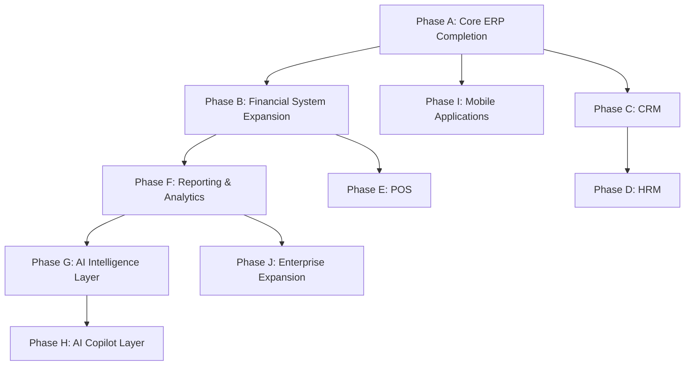

# ROADMAP.md

This document outlines the strategic product and technical roadmap for AgriQon ERP. It details the steps required to transition the system from its current active migration state into a fully featured, enterprise-grade, AI-powered Multi-Tenant SaaS ERP.

---

## 1. Current State Assessment

AgriQon is in the middle of a major architectural pivot: transitioning from a B2B2C marketplace to a B2B Multi-Tenant SaaS ERP. 

- **Database Schema**: Partially migrated. Relational double-entry models are defined (`JournalEntry`, `JournalLine`, `Account`), and multi-tenancy is logically isolated using `businessId` foreign keys. However, legacy tables (like `Review`, cart, and wishlist models) are still present.
- **Authentication**: Backend role models have been updated to support `OWNER`, `MANAGER`, and `STAFF` roles with granular permission keys. The frontend, however, still carries legacy `Buyer` and `Seller` role contexts, and the registration endpoints do not yet automatically provision business tenants.
- **System Services**: Outbox Adaptive Processor and BullMQ workers are in place for events and background processing. Speakeasy TOTP and Business IP rules are configured on the security layer.
- **Accounting**: The double-entry bookkeeping architecture is implemented but lacks automation. Ledger entries must currently be posted manually rather than generating automatically from sales and inventory events.

---

## 2. Product Maturity Assessment

| Dimension | Status | Target State | Gap / Action |
|---|---|---|---|
| **Core Workflows** | 🟡 Emerging | Complete ERP operations | Hide legacy marketplace features; complete invoice and inventory adjustments. |
| **Double-Entry Ledger** | 🟢 Functional | Full accounting automation | Automate journal postings from inventory and payment events. |
| **Access Control** | 🟡 Transitioning | Gated tenant permissions | Refactor frontend layouts to enforce backend dot-notation permission checks. |
| **Billing & Plans** | 🟢 Functional | Multi-gateway billing engine | Expand from SSLCommerz to bKash and Nagad mobile wallet webhook integrations. |

---

## 3. Technical Maturity Assessment

- **Modular Monolith**: Code borders are separated by modules under [modules](file:///d:/Projects/AgroAI%20Market/agriqon/backend/src/app/modules/). This is highly maintainable, but modules still share database transactions.
- **ORM & Database**: Prisma is generating queries correctly to `src/generated/client`. However, direct SQL queries (`$queryRaw`) are needed to execute performance-sensitive operations, such as `OutboxEvent` processing using `FOR UPDATE SKIP LOCKED`.
- **Infrastructure**: Lacks a unified monorepo management configuration (e.g., Turborepo). Packages run independently, which prevents dependency sync issues but increases build orchestration work.

---

## 4. SaaS Maturity Assessment

- **Tenant Isolation**: Achieved logically using the `businessId` column in PostgreSQL.
- **Usage Gating**: Implemented on the backend via the `UsageGuardService` checking users, products, and warehouses count limitations.
- **Grace Periods**: Configured via the `ReadOnlyGuardService` which transitions expired subscriptions into a write-locked, read-only state.
- **Provisioning**: The backend auto-provisions a `TRIAL` subscription on business creation. However, the user registration flow lacks integration to trigger this automatically.

---

## Roadmap Phases

### Phase A — Core ERP Completion

- **Business value**: Completes the pivot to ERP, removing legacy marketplace elements and establishing secure, permission-guarded workspaces.
- **Technical requirements**: Complete frontend refactor of user contexts and page routes to hide/replace legacy marketplace views; implement correct organizational settings layout.
- **Dependencies**: Database migration of platform-level roles and migration scripts.
- **Database impact**: Deletion of legacy storefront columns; database cleanup of unused marketplace schemas (e.g. legacy wishlists/shopping carts).
- **API impact**: Refactor `/auth/register` to auto-create a business and assign the creator as the `OWNER` role, returning the scoped tenant token.
- **Frontend impact**: Update `auth-context.tsx` and all dashboards to read `businessRole` permissions and prevent route navigation to `/cart` or `/wishlist`.
- **Estimated complexity**: Medium
- **Risk level**: Low
- **Success criteria**: 100% of routes gated by permissions; registration flow correctly auto-provisions businesses and sets owner.

---

### Phase B — Financial System Expansion

- **Business value**: Automates double-entry ledger bookkeeping. Posting is handled asynchronously by listening to business events, reducing human data-entry errors.
- **Technical requirements**: Implement asynchronous event listeners (subscribing to `order.completed`, `payment.verified`, and `inventory.adjusted` events) to trigger ledger entry creation.
- **Dependencies**: BullMQ workers and Outbox Processor.
- **Database impact**: None; uses the existing relational double-entry ledger tables.
- **API impact**: Add endpoints under `/api/v1/accounting/settings` to map inventory types to default ledger codes.
- **Frontend impact**: Build accounting settings interface allowing business owners to map payment/sales categories to specific ledger accounts.
- **Estimated complexity**: High
- **Risk level**: Medium
- **Success criteria**: 100% of verified orders automatically post equal debits/credits in the journal.

---

### Phase C — CRM (Customer Relationship Management)

- **Business value**: Allows businesses to manage customer leads, track sales pipelines, and log communication logs directly within the ERP.
- **Technical requirements**: Build a dedicated CRM module with lead validation and customer interaction logs.
- **Dependencies**: Core ERP completion.
- **Database impact**: New tables `Lead`, `Deal`, and `InteractionLog`.
- **API impact**: Create `/api/v1/crm/leads` and `/api/v1/crm/deals` CRUD routers.
- **Frontend impact**: Add dynamic Kanban boards representing deal stages and a timeline UI for communication logs.
- **Estimated complexity**: Medium
- **Risk level**: Low
- **Success criteria**: Businesses can track customer acquisition funnels from lead status to conversion.

---

### Phase D — HRM (Human Resource Management)

- **Business value**: Consolidates employee tracking, attendance logs, salary structures, and shift scheduling in a single platform.
- **Technical requirements**: Develop shift conflict detection logic and payroll calculator utilities.
- **Dependencies**: Core ERP completion.
- **Database impact**: New tables `Employee`, `AttendanceRecord`, `SalaryStructure`, and `WorkShift`.
- **API impact**: Endpoints `/api/v1/hrm/employees` and `/api/v1/hrm/payroll`.
- **Frontend impact**: Add an employee directory, shift calendar views, and payroll processing templates.
- **Estimated complexity**: Medium-High
- **Risk level**: Medium
- **Success criteria**: Attendance tracking, salary disbursement workflow, shift scheduling without overlaps.

---

### Phase E — POS (Point of Sale)

- **Business value**: Enables brick-and-mortar storefronts to process physical sales, scan barcodes, and deduct stock from specific warehouses in real-time.
- **Technical requirements**: Implement local offline storage sync capabilities (IndexedDB) and receipt formatting.
- **Dependencies**: Phase B Financial system expansion (for immediate cash account postings).
- **Database impact**: New tables `PosSession` and `RegisterClosure`.
- **API impact**: Lightweight, optimized endpoints `/api/v1/pos/checkout` for low-bandwidth scenarios.
- **Frontend impact**: Build a keyboard-friendly checkout grid optimized for cashiers.
- **Estimated complexity**: High
- **Risk level**: High
- **Success criteria**: Fast checkout capability in offline mode; automatic ledger posting and stock deduction upon reconnection.

---

### Phase F — Reporting & Analytics

- **Business value**: Provides business leaders with instant compliance-grade financial statements and asset valuation reports.
- **Technical requirements**: Implement weighted average cost (WAC) calculations and PDF generation workers.
- **Dependencies**: Phase B Financial system completion.
- **Database impact**: None; relies on database indexing on journal transaction dates.
- **API impact**: Add endpoints under `/api/v1/reports/` for balance sheets, profit & loss statements, and inventory valuation.
- **Frontend impact**: Design printable dashboard charts and report export configurations.
- **Estimated complexity**: Medium
- **Risk level**: Medium
- **Success criteria**: Balance Sheet and Profit & Loss report results match database ledger values with zero discrepancy.

---

### Phase G — AI Intelligence Layer

- **Business value**: Reduces stockouts by predicting stock demand and predicting purchase volumes based on historical sales data.
- **Technical requirements**: Implement predictive analysis workers that aggregate historical data and execute requests via the high-availability AI service.
- **Dependencies**: Phase F Reporting & Analytics.
- **Database impact**: None.
- **API impact**: Add `/api/v1/ai/predictions/inventory` endpoints.
- **Frontend impact**: Add predictive stock alerts and recommended reorder volumes inside the inventory dashboard.
- **Estimated complexity**: High
- **Risk level**: Low-Medium
- **Success criteria**: Inventory demand predictions show at least 80% accuracy based on historical datasets.

---

### Phase H — AI Copilot Layer

- **Business value**: Allows business staff to manage ERP records using natural language, speeding up workflows.
- **Technical requirements**: Develop a Natural Language Command Processor that maps chat inputs into structured JSON parameters.
- **Dependencies**: Phase G AI Intelligence Layer.
- **Database impact**: New table `AiCommandLog` for tracking commands.
- **API impact**: Add endpoint `/api/v1/ai/copilot/execute`.
- **Frontend impact**: Add a conversational slide-out panel accessible from any dashboard page.
- **Estimated complexity**: High
- **Risk level**: High
- **Success criteria**: 100% of write operations executed via the copilot require explicit human approval before mutating the database.

---

### Phase I — Mobile Applications

- **Business value**: Allows warehouse staff to scan barcodes directly on their phones and executives to monitor business performance on the go.
- **Technical requirements**: Create a React Native app with a local SQLite cache.
- **Dependencies**: Core ERP completion.
- **Database impact**: None.
- **API impact**: Add optimized mobile endpoints `/api/v1/mobile/` with lightweight payloads.
- **Frontend impact**: Mobile application interface optimized for touch controls.
- **Estimated complexity**: High
- **Risk level**: Medium
- **Success criteria**: Native Android/iOS builds run and sync barcode scans with the central warehouse inventory.

---

### Phase J — Enterprise Expansion

- **Business value**: Allows the platform to scale to large conglomerate clients with multi-organization support, custom single sign-on (SSO/SAML), customized print design templates, and Dedicated/On-Premises deployment setups.
- **Technical requirements**: SAML2 / OpenID Connect middleware; tenant-specific custom domain SSL routing; multi-tenant database routing middleware.
- **Dependencies**: Multi-tenant database connections.
- **Database impact**: Dedicated databases support mapping rules.
- **API impact**: SSO redirection handlers `/api/v1/auth/sso`.
- **Frontend impact**: Enterprise administrative dashboard.
- **Estimated complexity**: Very High
- **Risk level**: Low-Medium
- **Success criteria**: Enterprise client onboarding with SSO and dedicated database hosting.

---

## 12 Month Roadmap

### Q1: Core Pivot Completion & Security Hardening
- Complete Phase A (Core ERP Completion).
- Remove legacy marketplace routes on both frontend and backend.
- Align the `/auth/register` flow to automatically provision businesses and assign owners.
- Implement UI layout guards based on custom roles and permissions.

### Q2: Automated Financial Postings & Ledger Settings
- Complete Phase B (Financial System Expansion).
- Write domain event listeners for invoice, payment, and inventory mutations.
- Automate double-entry journal postings on transaction completions.

### Q3: Comprehensive Reporting & Compliance Exports
- Complete Phase F (Reporting & Analytics).
- Implement standard balance sheets, profit & loss, and trial balance calculations.
- Build PDF invoice generation and export workers.

### Q4: Customer Relationship Management (CRM)
- Complete Phase C (CRM).
- Deliver lead capturing, status tracking, Kanban board pipelines, and interaction timelines.

---

## 24 Month Roadmap

### Q5: Human Resource Management (HRM)
- Complete Phase D (HRM).
- Build shift planning calendars, automated payroll calculations, and attendance tracking.

### Q6: Point of Sale (POS) Interface
- Complete Phase E (POS).
- Build the cashier sales interface with local offline cache synchronization (IndexedDB).

### Q7: Mobile Apps (Inventory & Executive Dashboards)
- Complete Phase I (Mobile Applications).
- Compile native mobile applications for warehouse barcode scanning and executive reporting.

### Q8: AI Analytics & Demand Forecasting
- Complete Phase G (AI Intelligence Layer).
- Add demand forecasting and purchase recommendation systems.

---

## 36 Month Vision

- **AI Copilot (Phase H)**: Fully integrated natural language interface allowing users to run complex report generations and write operations safely.
- **Enterprise Conglomerates (Phase J)**: Dedicated hostings, single sign-on (SAML/SSO), and isolated tenant database configurations for enterprise clients.

---

## Recommended Execution Order

---

## What Should NOT Be Built Yet

1. **AI Copilot (Phase H)**: Do not build the natural language command execution layer until double-entry balancing validations and access restrictions are thoroughly tested. Running automated actions via LLMs without robust safeguards introduces high transaction risks.
2. **Enterprise Dedicated Hosting (Phase J)**: Complex setups, such as custom domains and dedicated database routing, should be deferred. Focus on maximizing SME multi-tenant efficiency before tackling custom infrastructure configs.
3. **Offline POS Sync (Phase E)**: Designing complex offline-to-online sync handlers before finalizing the central inventory and accounting ledger API schemas will lead to double-entry validation mismatches.
